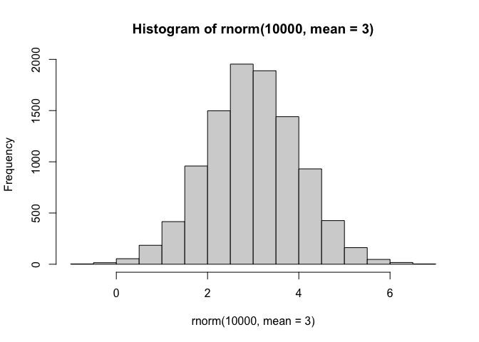
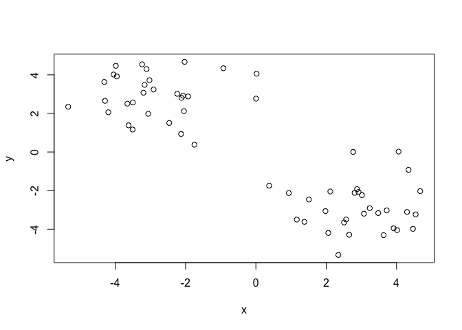
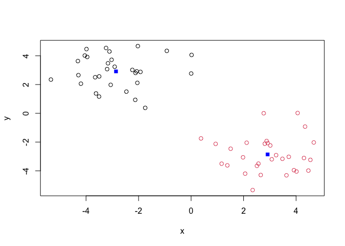
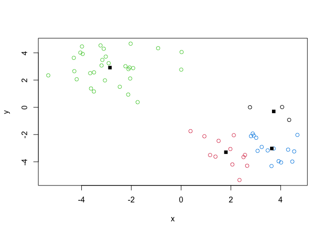
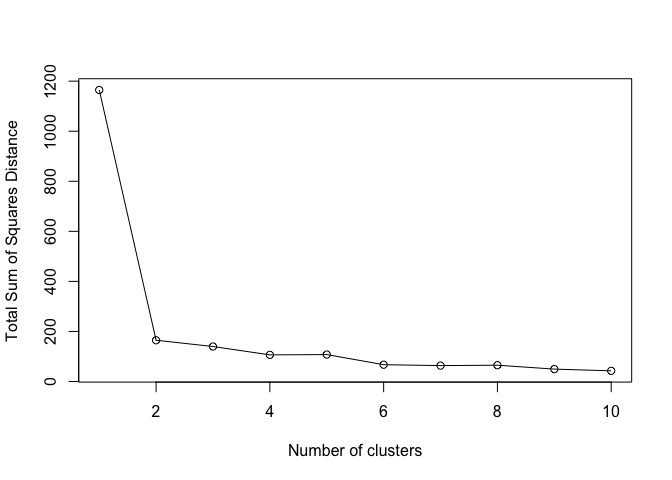
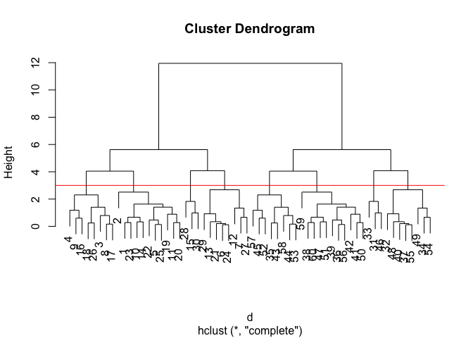
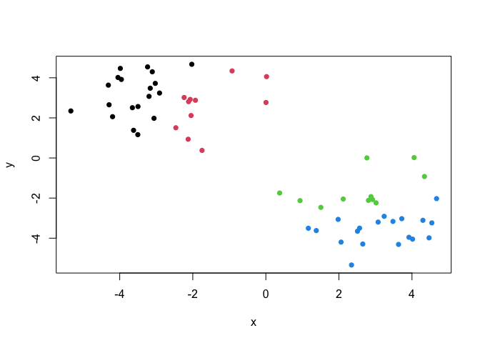
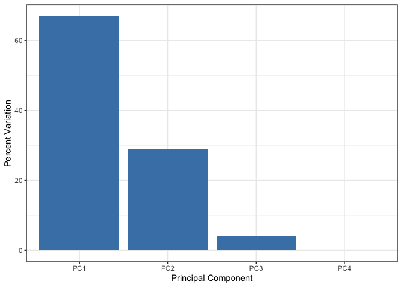
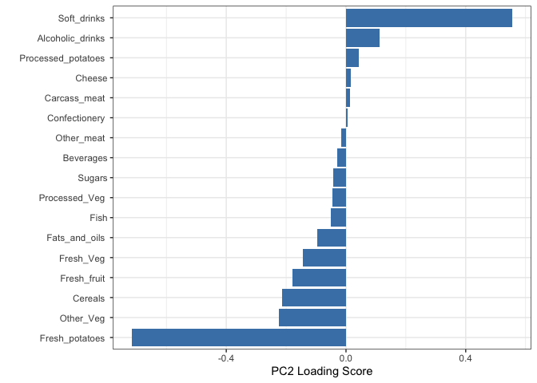

# Class 7 Machine Learning 1
Melissa (PID: A19149673)

- [Background](#background)
- [K-means clustering](#k-means-clustering)
- [Hierarchial Clustering](#hierarchial-clustering)
- [Principal Component Analysis
  (PCA)](#principal-component-analysis-pca)
- [Analysis of UK food data](#analysis-of-uk-food-data)
- [Data Import](#data-import)
- [Tidy the data](#tidy-the-data)
- [Exporatory analysis](#exporatory-analysis)
- [PCA](#pca)
- [Complete the following code to find out how many rows and columns are
  in
  x?](#complete-the-following-code-to-find-out-how-many-rows-and-columns-are-in-x)
- [PCA to the rescue](#pca-to-the-rescue)

## Background

Today we will explore some core machine learning methods that are very
popular in bioinformatics. These include **clustering** and
**dimensionality reduction**.

## K-means clustering

The main function in “base” R for K-means clustering is called
`kmeans()`

Before we go too deep let’s make up some “simple” data that we can
cluster and know if we are getting agood answer or not. To do this we
can use `rnorm()` function:

``` r
hist( rnorm (10000, mean = 3))
```



``` r
x <- c( rnorm(30, -3),rnorm(30, +3))
z <- cbind(x=x, y = rev(x))
plot(z)
```



``` r
p <- 1:5
rev(p)
```

    [1] 5 4 3 2 1

Now we can run `kmeans()` on this input `z` and see what the results
look like.

``` r
km <- kmeans(z, centers = 2)
km
```

    K-means clustering with 2 clusters of sizes 30, 30

    Cluster means:
              x         y
    1 -2.859072  2.914671
    2  2.914671 -2.859072

    Clustering vector:
     [1] 1 1 1 1 1 1 1 1 1 1 1 1 1 1 1 1 1 1 1 1 1 1 1 1 1 1 1 1 1 1 2 2 2 2 2 2 2 2
    [39] 2 2 2 2 2 2 2 2 2 2 2 2 2 2 2 2 2 2 2 2 2 2

    Within cluster sum of squares by cluster:
    [1] 82.40069 82.40069
     (between_SS / total_SS =  85.9 %)

    Available components:

    [1] "cluster"      "centers"      "totss"        "withinss"     "tot.withinss"
    [6] "betweenss"    "size"         "iter"         "ifault"      

``` r
attributes(km)
```

    $names
    [1] "cluster"      "centers"      "totss"        "withinss"     "tot.withinss"
    [6] "betweenss"    "size"         "iter"         "ifault"      

    $class
    [1] "kmeans"

> Q. How many points are in each cluster?

``` r
km$size
```

    [1] 30 30

> Q. What “component of your result object details cluster
> assignment/membership”?

``` r
km$cluster
```

     [1] 1 1 1 1 1 1 1 1 1 1 1 1 1 1 1 1 1 1 1 1 1 1 1 1 1 1 1 1 1 1 2 2 2 2 2 2 2 2
    [39] 2 2 2 2 2 2 2 2 2 2 2 2 2 2 2 2 2 2 2 2 2 2

> Q. What “component of your result object details cluster center”?

``` r
km$centers
```

              x         y
    1 -2.859072  2.914671
    2  2.914671 -2.859072

> Q. Plot `z` colored by the kmeans cluster assignment and add cluster
> centers as blue points.

``` r
plot(z, col=km$cluster)
points(km$centers, col = "blue", pch = 15)
```



> Q. Run a K-means clustering and plot the results asking for 4
> clusters? (k=4)?

``` r
km4 <- kmeans(z, centers = 4)
plot (z, col=km4$cluster)
points(km4$centers, col ="black", pch = 15)
```



> **N.B.** You need to tell K-means the number of clusters (i.e. set
> `centers=2`)!!

One approach is to try different values for `centers` and then pick the
best…

``` r
ans <- NULL
for(i in 1:10) {
km <- kmeans(z, centers=i)
ans <- c(ans, km$tot.withinss)
}

plot(ans, typ="o", xlab = "Number of clusters",
     ylab = "Total Sum of Squares Distance")
```



## Hierarchial Clustering

The main function in “base” R for Hierarchial Clustering is called
`hclust()`

This function does not take your “raw” data for clustering. You must
first build a “distance matrix” from your data and pass this as input to
`hclust()`

``` r
d <- dist(z)
hc <- hclust(d)
hc
```


    Call:
    hclust(d = d)

    Cluster method   : complete 
    Distance         : euclidean 
    Number of objects: 60 

There is a bespoke `plot()` method for `hclust()` result objects.

``` r
plot(hc)
abline(h = 3, col = "red")
```



Once we have our `hclust` object (our “tree” of “cluster dendrogram”) we
can *“cut”* the tree to reveal the clustering pattern.

``` r
cutree(hc, k=4)
```

     [1] 1 1 1 1 1 2 2 1 1 1 1 2 2 1 2 1 1 1 1 1 2 1 1 2 1 1 2 2 2 2 3 3 3 3 4 4 3 4
    [39] 4 3 4 4 4 4 4 3 4 3 3 4 4 4 4 3 3 4 4 4 4 4

> Q. Make a plot of `z` with your hclust results (i.e. colored by
> cluster membership)

``` r
grps <- cutree(hc, k = 4)
plot(z, col= grps, pch =16)
```



## Principal Component Analysis (PCA)

PCA is a dimensionallity of reduction method that is popular for
revealing patterns in complex datasets.

## Analysis of UK food data

Let’s look at some data on the eating habits of folks from the UK to see
if there are patterns and trends that have some regions being distinct
from others.

## Data Import

The data is made available in CSV format so we can use `read.csv()`
function for import to R:

``` r
url <- "https://tinyurl.com/UK-foods"
x <- read.csv(url)
x
```

                         X England Wales Scotland N.Ireland
    1               Cheese     105   103      103        66
    2        Carcass_meat      245   227      242       267
    3          Other_meat      685   803      750       586
    4                 Fish     147   160      122        93
    5       Fats_and_oils      193   235      184       209
    6               Sugars     156   175      147       139
    7      Fresh_potatoes      720   874      566      1033
    8           Fresh_Veg      253   265      171       143
    9           Other_Veg      488   570      418       355
    10 Processed_potatoes      198   203      220       187
    11      Processed_Veg      360   365      337       334
    12        Fresh_fruit     1102  1137      957       674
    13            Cereals     1472  1582     1462      1494
    14           Beverages      57    73       53        47
    15        Soft_drinks     1374  1256     1572      1506
    16   Alcoholic_drinks      375   475      458       135
    17      Confectionery       54    64       62        41

## Tidy the data

Fix anything that went wrong with the data import.

## Exporatory analysis

Make some plots to help make sense of obvious trends…

## PCA

> Q1. How many rows and columns are in your new data frame named x? What
> R functions could you use to answer this questions?

## Complete the following code to find out how many rows and columns are in x?

``` r
dim(x)
```

    [1] 17  5

\##Preview the first 6 rows

``` r
head(x)
```

                   X England Wales Scotland N.Ireland
    1         Cheese     105   103      103        66
    2  Carcass_meat      245   227      242       267
    3    Other_meat      685   803      750       586
    4           Fish     147   160      122        93
    5 Fats_and_oils      193   235      184       209
    6         Sugars     156   175      147       139

``` r
rownames(x) <- x[,1] # This keeps only column 1
x <- x[,-1] #This keeps everything except column 1
head(x)
```

                   England Wales Scotland N.Ireland
    Cheese             105   103      103        66
    Carcass_meat       245   227      242       267
    Other_meat         685   803      750       586
    Fish               147   160      122        93
    Fats_and_oils      193   235      184       209
    Sugars             156   175      147       139

``` r
dim(x)
```

    [1] 17  4

There are 17 rows and 4 columns after fixing the row names.

``` r
x <- read.csv(url, row.names=1)
head(x)
```

                   England Wales Scotland N.Ireland
    Cheese             105   103      103        66
    Carcass_meat       245   227      242       267
    Other_meat         685   803      750       586
    Fish               147   160      122        93
    Fats_and_oils      193   235      184       209
    Sugars             156   175      147       139

> Q2. Which approach to solving the ‘row-names problem’ mentioned above
> do you prefer and why? Is one approach more robust than another under
> certain circumstances?

``` r
barplot(as.matrix(x), beside=T, col=rainbow(nrow(x)))
```


Setting row names during import is more robust since it avoids extra
steps and prevents error later.

> Q3. Changing what optional argument in the above barplot() function
> results in the following plot?

``` r
cols <-rainbow(nrow(x))
barplot(as.matrix(x), col=cols)
```


``` r
dim(x)
```

    [1] 17  4

``` r
head(x)
```

                   England Wales Scotland N.Ireland
    Cheese             105   103      103        66
    Carcass_meat       245   227      242       267
    Other_meat         685   803      750       586
    Fish               147   160      122        93
    Fats_and_oils      193   235      184       209
    Sugars             156   175      147       139

``` r
library(tidyr)

x_long <- x |> 
          tibble::rownames_to_column("Food") |> 
          pivot_longer(cols = -Food, 
                       names_to = "Country", 
                       values_to = "Consumption")

dim(x_long)
```

    [1] 68  3

``` r
library(ggplot2)

ggplot(x_long) +
  aes(x = Country, y = Consumption, fill = Food) +
  geom_col(position = "dodge") +
  theme_bw()
```


The change comes from changing the argument that controls how the bars
are arranged. Also determines whether the barplot shows separate bars
for each category as well as combined stack bars.

> Q4: Changing what optional argument in the above ggplot() code results
> in a stacked barplot figure?

``` r
ggplot(x_long) +
  aes(x = Country, y = Consumption, fill = Food) +
  geom_col(position = "stack") +
  theme_bw()
```


Switching the argument changes the plot from comparing categories
separately to show their combined totals within each group.

> Q5: We can use the pairs() function to generate all pairwise plots for
> our countries. Can you make sense of the following code and resulting
> figure? What does it mean if a given point lies on the diagonal for a
> given plot?

``` r
pairs(x, col=rainbow(nrow(x)), pch=16)
```


``` r
library(pheatmap)
pheatmap(as.matrix(x))
```


The pairs() plot shows all pairwise comparison between the countries.
This helps visually show how similar and different countries are based
on their food consumption across the categories.

> Q6. Based on the pairs and heatmap figures, which countries cluster
> together and what does this suggest about their food consumption
> patterns? Can you easily tell what the main differences between N.
> Ireland and the other countries of the UK in terms of this data-set?

> **Key-point**: Even relatively small datasets can prove challenging to
> interpret.

## PCA to the rescue

``` r
t(x)
```

              Cheese Carcass_meat  Other_meat  Fish Fats_and_oils  Sugars
    England      105           245         685  147            193    156
    Wales        103           227         803  160            235    175
    Scotland     103           242         750  122            184    147
    N.Ireland     66           267         586   93            209    139
              Fresh_potatoes  Fresh_Veg  Other_Veg  Processed_potatoes 
    England               720        253        488                 198
    Wales                 874        265        570                 203
    Scotland              566        171        418                 220
    N.Ireland            1033        143        355                 187
              Processed_Veg  Fresh_fruit  Cereals  Beverages Soft_drinks 
    England              360         1102     1472        57         1374
    Wales                365         1137     1582        73         1256
    Scotland             337          957     1462        53         1572
    N.Ireland            334          674     1494        47         1506
              Alcoholic_drinks  Confectionery 
    England                 375             54
    Wales                   475             64
    Scotland                458             62
    N.Ireland               135             41

The main function in “base” R for PCA is called `prompt()`. This
function wants the observations to be rows and the variables to be
columns.

``` r
pca <- prcomp( t(x) )
summary(pca)
```

    Importance of components:
                                PC1      PC2      PC3       PC4
    Standard deviation     324.1502 212.7478 73.87622 2.921e-14
    Proportion of Variance   0.6744   0.2905  0.03503 0.000e+00
    Cumulative Proportion    0.6744   0.9650  1.00000 1.000e+00

``` r
attributes(pca)
```

    $names
    [1] "sdev"     "rotation" "center"   "scale"    "x"       

    $class
    [1] "prcomp"

The main result figure from this analysis is called “PC score plot” or
“ordination plot” “PC olot” or PC1 vs PC2 plot”.

This plot show samples (in this case countries) relate to each other
along our new PC axis.

This is our new “reduced-dimensional space”. In this case2 dimensions,
PC1 and PC2, that capture most of the variance to the original 17
dimensional data-set.

``` r
pca$x
```

                     PC1         PC2        PC3           PC4
    England   -144.99315   -2.532999 105.768945 -9.152022e-15
    Wales     -240.52915 -224.646925 -56.475555  5.560040e-13
    Scotland   -91.86934  286.081786 -44.415495 -6.638419e-13
    N.Ireland  477.39164  -58.901862  -4.877895  1.329771e-13

England, Wales and Scotland cluster together to show similar diets while
Northern Ireland is pretty distinct. However, the specific food
differences require further analysis such as the PCA loading’s to be
able to identify.

> Q7. Complete the code below to generate a plot of PC1 vs PC2. The
> second line adds text labels over the data points.

``` r
df <- as.data.frame(pca$x)
df$Country <- rownames(df)

ggplot(pca$x) +
  aes(x = PC1, y = PC2, label = rownames(pca$x)) +
  geom_point(size = 3) +
  geom_text(vjust = -0.5) +
  xlim(-270, 500) +
  xlab("PC1") +
  ylab("PC2") +
  theme_bw()
```


> Q8. Customize your plot so that the colors of the country names match
> the colors in our UK and Ireland map and table at start of this
> document.

``` r
df <- as.data.frame(pca$x)
df$Country <- rownames(df)

ggplot(df) +
  aes(x = PC1, y = PC2, label = Country, color = Country) +
  geom_point(size = 3) +
  geom_text(vjust = -0.5) +
  scale_color_manual(values = c(
    "England" = "orange",
    "Wales" = "red",
    "Scotland" = "blue",
    "N.Ireland" = "darkgreen"
  )) +
  xlim(-270, 500) +
  xlab("PC1") +
  ylab("PC2") +
  theme_bw()
```


``` r
v <- round( pca$sdev^2/sum(pca$sdev^2) * 100 )
v
```

    [1] 67 29  4  0

``` r
z <- summary(pca)
z$importance
```

                                 PC1       PC2      PC3          PC4
    Standard deviation     324.15019 212.74780 73.87622 2.921348e-14
    Proportion of Variance   0.67444   0.29052  0.03503 0.000000e+00
    Cumulative Proportion    0.67444   0.96497  1.00000 1.000000e+00

``` r
# Create scree plot with ggplot
variance_df <- data.frame(
  PC = factor(paste0("PC", 1:length(v)), levels = paste0("PC", 1:length(v))),
  Variance = v
)

ggplot(variance_df) +
  aes(x = PC, y = Variance) +
  geom_col(fill = "steelblue") +
  xlab("Principal Component") +
  ylab("Percent Variation") +
  theme_bw() +
  theme(axis.text.x = element_text(angle = 0))
```



``` r
ggplot(pca$rotation) +
  aes(x = PC1, 
      y = reorder(rownames(pca$rotation), PC1)) +
  geom_col(fill = "steelblue") +
  xlab("PC1 Loading Score") +
  ylab("") +
  theme_bw() +
  theme(axis.text.y = element_text(size = 9))
```


> Q9: Generate a similar ‘loadings plot’ for PC2. What two food groups
> feature prominantely and what does PC2 maninly tell us about?

``` r
ggplot(pca$rotation) +
  aes(x = PC2, 
      y = reorder(rownames(pca$rotation), PC2)) +
  geom_col(fill = "steelblue") +
  xlab("PC2 Loading Score") +
  ylab("") +
  theme_bw()
```



The food groups that feature most prominently in PC2 are those with the
largest positive and negative loading scores such as fish and
fats_and_oils. These variables contribute strongly to the variation
captured by PC2. PC2 also represents a secondary dietary pattern, as
this distinguishes countries based on differences in specific types of
food consumption rather than overall intake. Moreover, PC1 explains
about 67% of the variance while PC2 explains about 29%.
