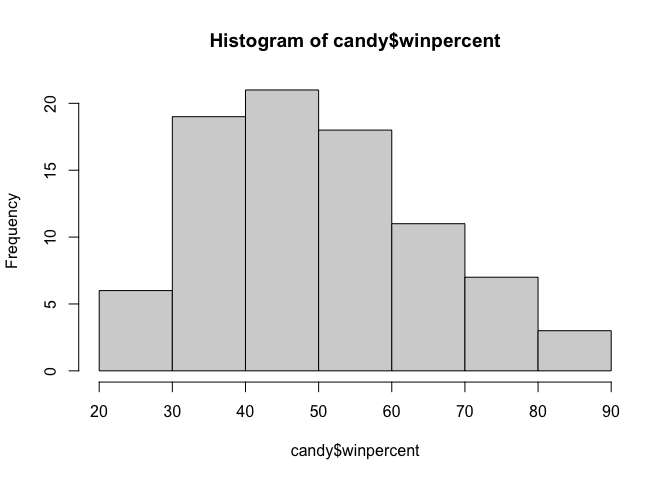
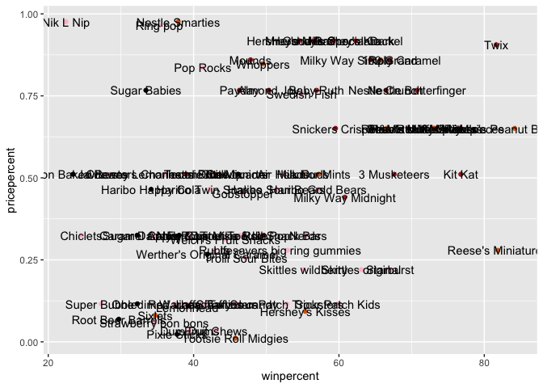
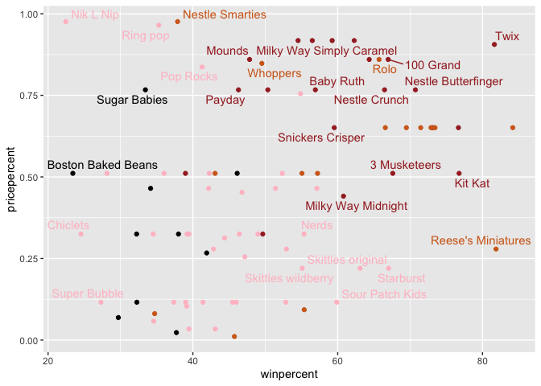
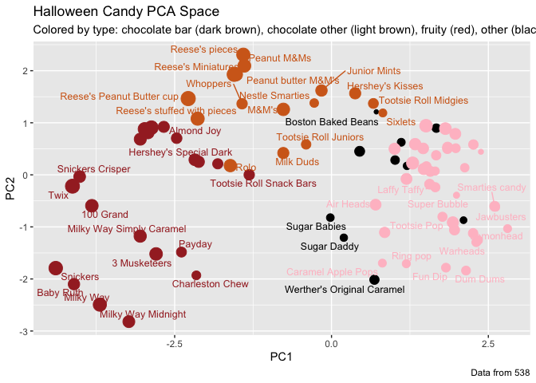
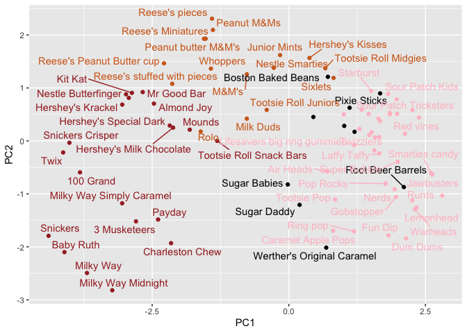

# Class 09: Candy Mini-Project
Melissa (PID: A19149673)

- [Background](#background)
- [Data Import](#data-import)
- [Exploratory Analysis](#exploratory-analysis)
- [Overall Candy Rankings](#overall-candy-rankings)
- [Taking a look at pricepercent](#taking-a-look-at-pricepercent)
- [Exploring the Correlation
  Structure](#exploring-the-correlation-structure)
- [Principal Component Analysis](#principal-component-analysis)
- [Summary](#summary)

## Background

Today we are taking a detor to analyze a fun dataset (that we have more
intrinsic insight into) with the most useful analysis method we have
learned thus for - Principal Compenent Analysis (PCA)

## Data Import

The data is all related to halloween candy and is from the 538 website.

``` r
candy <- read.csv ("candy-data.txt", row.names = 1)
head(candy)
```

                 chocolate fruity caramel peanutyalmondy nougat crispedricewafer
    100 Grand            1      0       1              0      0                1
    3 Musketeers         1      0       0              0      1                0
    One dime             0      0       0              0      0                0
    One quarter          0      0       0              0      0                0
    Air Heads            0      1       0              0      0                0
    Almond Joy           1      0       0              1      0                0
                 hard bar pluribus sugarpercent pricepercent winpercent
    100 Grand       0   1        0        0.732        0.860   66.97173
    3 Musketeers    0   1        0        0.604        0.511   67.60294
    One dime        0   0        0        0.011        0.116   32.26109
    One quarter     0   0        0        0.011        0.511   46.11650
    Air Heads       0   0        0        0.906        0.511   52.34146
    Almond Joy      0   1        0        0.465        0.767   50.34755

> Q1. How mant different candy types are in this dataset?

``` r
nrow(candy)
```

    [1] 85

> Q2. How many fruity candy types are in the dataset?

``` r
sum(candy$fruity)
```

    [1] 38

> Q3. What is your favorite candy (other than Twix) in the dataset and
> what is it’s winpercent value?

``` r
library(dplyr)
```


    Attaching package: 'dplyr'

    The following objects are masked from 'package:stats':

        filter, lag

    The following objects are masked from 'package:base':

        intersect, setdiff, setequal, union

``` r
candy |> 
  filter(row.names(candy)=="Almond Joy") |> 
  select(winpercent)
```

               winpercent
    Almond Joy   50.34755

``` r
# filter() selects rows that match a condition, specifically selecting a 
#specific candy shown here

# select() chooses specific columns from the dataset
```

> Q4. What is the winpercent value for “Kit Kat”?

``` r
candy |> 
  filter(row.names(candy)=="Kit Kat") |> 
  select(winpercent)
```

            winpercent
    Kit Kat    76.7686

> Q5. What is the winpercent value for “Tootsie Roll Snack Bars”?

``` r
candy |> 
  filter(row.names(candy)=="Tootsie Roll Snack Bars") |> 
  select(winpercent)
```

                            winpercent
    Tootsie Roll Snack Bars    49.6535

There is a useful `skim()` function in the **skimr** package that can
help give you a quick overview of a given dataset. Let’s install this
package and try it on our candy data.

``` r
library("skimr")
skim(candy)
```

|                                                  |       |
|:-------------------------------------------------|:------|
| Name                                             | candy |
| Number of rows                                   | 85    |
| Number of columns                                | 12    |
| \_\_\_\_\_\_\_\_\_\_\_\_\_\_\_\_\_\_\_\_\_\_\_   |       |
| Column type frequency:                           |       |
| numeric                                          | 12    |
| \_\_\_\_\_\_\_\_\_\_\_\_\_\_\_\_\_\_\_\_\_\_\_\_ |       |
| Group variables                                  | None  |

Data summary

**Variable type: numeric**

| skim_variable | n_missing | complete_rate | mean | sd | p0 | p25 | p50 | p75 | p100 | hist |
|:---|---:|---:|---:|---:|---:|---:|---:|---:|---:|:---|
| chocolate | 0 | 1 | 0.44 | 0.50 | 0.00 | 0.00 | 0.00 | 1.00 | 1.00 | ▇▁▁▁▆ |
| fruity | 0 | 1 | 0.45 | 0.50 | 0.00 | 0.00 | 0.00 | 1.00 | 1.00 | ▇▁▁▁▆ |
| caramel | 0 | 1 | 0.16 | 0.37 | 0.00 | 0.00 | 0.00 | 0.00 | 1.00 | ▇▁▁▁▂ |
| peanutyalmondy | 0 | 1 | 0.16 | 0.37 | 0.00 | 0.00 | 0.00 | 0.00 | 1.00 | ▇▁▁▁▂ |
| nougat | 0 | 1 | 0.08 | 0.28 | 0.00 | 0.00 | 0.00 | 0.00 | 1.00 | ▇▁▁▁▁ |
| crispedricewafer | 0 | 1 | 0.08 | 0.28 | 0.00 | 0.00 | 0.00 | 0.00 | 1.00 | ▇▁▁▁▁ |
| hard | 0 | 1 | 0.18 | 0.38 | 0.00 | 0.00 | 0.00 | 0.00 | 1.00 | ▇▁▁▁▂ |
| bar | 0 | 1 | 0.25 | 0.43 | 0.00 | 0.00 | 0.00 | 0.00 | 1.00 | ▇▁▁▁▂ |
| pluribus | 0 | 1 | 0.52 | 0.50 | 0.00 | 0.00 | 1.00 | 1.00 | 1.00 | ▇▁▁▁▇ |
| sugarpercent | 0 | 1 | 0.48 | 0.28 | 0.01 | 0.22 | 0.47 | 0.73 | 0.99 | ▇▇▇▇▆ |
| pricepercent | 0 | 1 | 0.47 | 0.29 | 0.01 | 0.26 | 0.47 | 0.65 | 0.98 | ▇▇▇▇▆ |
| winpercent | 0 | 1 | 50.32 | 14.71 | 22.45 | 39.14 | 47.83 | 59.86 | 84.18 | ▃▇▆▅▂ |

``` r
# The skim() function provides a summary of the dataset by grouping variables 
# based on their data type. 

# skim(candy) scans through the dataset and organizes the output by variable 
# type.
```

> Q6. Is there any variable/column that looks to be on a different scale
> to the majority of the other columns in the dataset?

Yes, the winpercent variable is on a different scale in comparison to
the majority of other columns. Even though most variables are binary 0
or 1, winpercent is a continuous variable representing a percentage.
Additionally, the values range from 0 to 100.

> Q7. What do you think a zero and one represent for the
> candy\$chocolate column?

In the candy\$chocolate column, a value of 1 indicates that the candy
contains chocolate, while a value of 0 indicates that it does not.

## Exploratory Analysis

> Q8. Plot a histogram of winpercent values using both base R and
> ggplot2.

``` r
hist(candy$winpercent)
```



``` r
library(ggplot2)

ggplot(candy) +
  aes(winpercent) +
  geom_histogram(bins=20)
```


> Q9. Is the distribution of winpercent values symmetrical?

No, the distribution of the winpercent values skew to the right.

> Q10. Is the center of the distribution above or below 50%?

``` r
mean(candy$winpercent)
```

    [1] 50.31676

``` r
summary(candy$winpercent)
```

       Min. 1st Qu.  Median    Mean 3rd Qu.    Max. 
      22.45   39.14   47.83   50.32   59.86   84.18 

The center of the distribution is below 50% since the median winpercent
is 47.83%. Even though the mean is slightly above 50%, the median better
represents the center because the distribution is slightly skewed.

> Q11. On average is chocolate candy higher or lower ranked than fruit
> candy?

``` r
choc.ind <- as.logical(candy$chocolate)
choc.candy <- candy[choc.ind,]
choc.win <- choc.candy$winpercent
choc.win
```

     [1] 66.97173 67.60294 50.34755 56.91455 38.97504 55.37545 62.28448 56.49050
     [9] 59.23612 57.21925 76.76860 71.46505 66.57458 55.06407 73.09956 60.80070
    [17] 64.35334 47.82975 54.52645 70.73564 66.47068 69.48379 81.86626 84.18029
    [25] 73.43499 72.88790 65.71629 34.72200 37.88719 76.67378 59.52925 48.98265
    [33] 43.06890 45.73675 49.65350 81.64291 49.52411

``` r
mean(choc.win)
```

    [1] 60.92153

``` r
fruit.ind <- as.logical(candy$fruity)
# converts the chocolate column into True/False values
fruit.candy <- candy[fruit.ind,]
# subsets the dataset to only include chocolate candies
fruit.win <- fruit.candy$winpercent
# extracts the winpercent values for chocolate candies
mean(fruit.win)
```

    [1] 44.11974

``` r
# this calculates the average winpercent f  or chocolate candies
```

``` r
candy |>
  group_by(chocolate) |>
  # group_by() splits the data into groups (such as chocolate versus non 
# chocolate)
  summarise(avg_win = mean(winpercent))
```

    # A tibble: 2 × 2
      chocolate avg_win
          <int>   <dbl>
    1         0    42.1
    2         1    60.9

``` r
# summarise() calculates a summary statistic (mean winpercent) for each group
```

On average, chocolate candy is ranked higher than fruit candy, as
candies containing chocolate have a higher mean winpercent.

> Q12. Is this difference statistically significant?

``` r
t.test(choc.win, fruit.win)
```


        Welch Two Sample t-test

    data:  choc.win and fruit.win
    t = 6.2582, df = 68.882, p-value = 2.871e-08
    alternative hypothesis: true difference in means is not equal to 0
    95 percent confidence interval:
     11.44563 22.15795
    sample estimates:
    mean of x mean of y 
     60.92153  44.11974 

Yes, the difference is statistically significant since the p-value,
2.871e-08, from the t-test is less than 0.05. This suggests that the
difference in average winpercent between chocolate candies and fruity
candies is unlikely to be due to chance.

## Overall Candy Rankings

> Q13. What are the five least liked candy types in this set?

``` r
candy |>
  arrange(winpercent) |>
  # arrange() sorts the data in ascending order by winpercent
  select(winpercent) |>
  head(5)
```

                       winpercent
    Nik L Nip            22.44534
    Boston Baked Beans   23.41782
    Chiclets             24.52499
    Super Bubble         27.30386
    Jawbusters           28.12744

The 5 least liked candy are Nik L Nip, Boston Baked Beans, Chiclets,
Super Bubble and Jawbusters.

``` r
x <- c(5,10,1)
sort(x)
```

    [1]  1  5 10

``` r
order(x)
```

    [1] 3 1 2

``` r
candy[ order(candy$winpercent), ]
```

                                chocolate fruity caramel peanutyalmondy nougat
    Nik L Nip                           0      1       0              0      0
    Boston Baked Beans                  0      0       0              1      0
    Chiclets                            0      1       0              0      0
    Super Bubble                        0      1       0              0      0
    Jawbusters                          0      1       0              0      0
    Root Beer Barrels                   0      0       0              0      0
    Sugar Daddy                         0      0       1              0      0
    One dime                            0      0       0              0      0
    Sugar Babies                        0      0       1              0      0
    Haribo Happy Cola                   0      0       0              0      0
    Caramel Apple Pops                  0      1       1              0      0
    Strawberry bon bons                 0      1       0              0      0
    Sixlets                             1      0       0              0      0
    Ring pop                            0      1       0              0      0
    Chewey Lemonhead Fruit Mix          0      1       0              0      0
    Red vines                           0      1       0              0      0
    Pixie Sticks                        0      0       0              0      0
    Nestle Smarties                     1      0       0              0      0
    Candy Corn                          0      0       0              0      0
    Charleston Chew                     1      0       0              0      1
    Warheads                            0      1       0              0      0
    Lemonhead                           0      1       0              0      0
    Fun Dip                             0      1       0              0      0
    Now & Later                         0      1       0              0      0
    Dum Dums                            0      1       0              0      0
    Pop Rocks                           0      1       0              0      0
    Laffy Taffy                         0      1       0              0      0
    Werther's Original Caramel          0      0       1              0      0
    Haribo Twin Snakes                  0      1       0              0      0
    Dots                                0      1       0              0      0
    Runts                               0      1       0              0      0
    Tootsie Roll Juniors                1      0       0              0      0
    Fruit Chews                         0      1       0              0      0
    Welch's Fruit Snacks                0      1       0              0      0
    Twizzlers                           0      1       0              0      0
    Tootsie Roll Midgies                1      0       0              0      0
    Smarties candy                      0      1       0              0      0
    One quarter                         0      0       0              0      0
    Payday                              0      0       0              1      1
    Mike & Ike                          0      1       0              0      0
    Gobstopper                          0      1       0              0      0
    Trolli Sour Bites                   0      1       0              0      0
    Mounds                              1      0       0              0      0
    Tootsie Pop                         1      1       0              0      0
    Whoppers                            1      0       0              0      0
    Tootsie Roll Snack Bars             1      0       0              0      0
    Almond Joy                          1      0       0              1      0
    Haribo Sour Bears                   0      1       0              0      0
    Air Heads                           0      1       0              0      0
    Sour Patch Tricksters               0      1       0              0      0
    Lifesavers big ring gummies         0      1       0              0      0
    Mr Good Bar                         1      0       0              1      0
    Swedish Fish                        0      1       0              0      0
    Milk Duds                           1      0       1              0      0
    Skittles wildberry                  0      1       0              0      0
    Nerds                               0      1       0              0      0
    Hershey's Kisses                    1      0       0              0      0
    Hershey's Milk Chocolate            1      0       0              0      0
    Baby Ruth                           1      0       1              1      1
    Haribo Gold Bears                   0      1       0              0      0
    Junior Mints                        1      0       0              0      0
    Hershey's Special Dark              1      0       0              0      0
    Snickers Crisper                    1      0       1              1      0
    Sour Patch Kids                     0      1       0              0      0
    Milky Way Midnight                  1      0       1              0      1
    Hershey's Krackel                   1      0       0              0      0
    Skittles original                   0      1       0              0      0
    Milky Way Simply Caramel            1      0       1              0      0
    Rolo                                1      0       1              0      0
    Nestle Crunch                       1      0       0              0      0
    M&M's                               1      0       0              0      0
    100 Grand                           1      0       1              0      0
    Starburst                           0      1       0              0      0
    3 Musketeers                        1      0       0              0      1
    Peanut M&Ms                         1      0       0              1      0
    Nestle Butterfinger                 1      0       0              1      0
    Peanut butter M&M's                 1      0       0              1      0
    Reese's stuffed with pieces         1      0       0              1      0
    Milky Way                           1      0       1              0      1
    Reese's pieces                      1      0       0              1      0
    Snickers                            1      0       1              1      1
    Kit Kat                             1      0       0              0      0
    Twix                                1      0       1              0      0
    Reese's Miniatures                  1      0       0              1      0
    Reese's Peanut Butter cup           1      0       0              1      0
                                crispedricewafer hard bar pluribus sugarpercent
    Nik L Nip                                  0    0   0        1        0.197
    Boston Baked Beans                         0    0   0        1        0.313
    Chiclets                                   0    0   0        1        0.046
    Super Bubble                               0    0   0        0        0.162
    Jawbusters                                 0    1   0        1        0.093
    Root Beer Barrels                          0    1   0        1        0.732
    Sugar Daddy                                0    0   0        0        0.418
    One dime                                   0    0   0        0        0.011
    Sugar Babies                               0    0   0        1        0.965
    Haribo Happy Cola                          0    0   0        1        0.465
    Caramel Apple Pops                         0    0   0        0        0.604
    Strawberry bon bons                        0    1   0        1        0.569
    Sixlets                                    0    0   0        1        0.220
    Ring pop                                   0    1   0        0        0.732
    Chewey Lemonhead Fruit Mix                 0    0   0        1        0.732
    Red vines                                  0    0   0        1        0.581
    Pixie Sticks                               0    0   0        1        0.093
    Nestle Smarties                            0    0   0        1        0.267
    Candy Corn                                 0    0   0        1        0.906
    Charleston Chew                            0    0   1        0        0.604
    Warheads                                   0    1   0        0        0.093
    Lemonhead                                  0    1   0        0        0.046
    Fun Dip                                    0    1   0        0        0.732
    Now & Later                                0    0   0        1        0.220
    Dum Dums                                   0    1   0        0        0.732
    Pop Rocks                                  0    1   0        1        0.604
    Laffy Taffy                                0    0   0        0        0.220
    Werther's Original Caramel                 0    1   0        0        0.186
    Haribo Twin Snakes                         0    0   0        1        0.465
    Dots                                       0    0   0        1        0.732
    Runts                                      0    1   0        1        0.872
    Tootsie Roll Juniors                       0    0   0        0        0.313
    Fruit Chews                                0    0   0        1        0.127
    Welch's Fruit Snacks                       0    0   0        1        0.313
    Twizzlers                                  0    0   0        0        0.220
    Tootsie Roll Midgies                       0    0   0        1        0.174
    Smarties candy                             0    1   0        1        0.267
    One quarter                                0    0   0        0        0.011
    Payday                                     0    0   1        0        0.465
    Mike & Ike                                 0    0   0        1        0.872
    Gobstopper                                 0    1   0        1        0.906
    Trolli Sour Bites                          0    0   0        1        0.313
    Mounds                                     0    0   1        0        0.313
    Tootsie Pop                                0    1   0        0        0.604
    Whoppers                                   1    0   0        1        0.872
    Tootsie Roll Snack Bars                    0    0   1        0        0.465
    Almond Joy                                 0    0   1        0        0.465
    Haribo Sour Bears                          0    0   0        1        0.465
    Air Heads                                  0    0   0        0        0.906
    Sour Patch Tricksters                      0    0   0        1        0.069
    Lifesavers big ring gummies                0    0   0        0        0.267
    Mr Good Bar                                0    0   1        0        0.313
    Swedish Fish                               0    0   0        1        0.604
    Milk Duds                                  0    0   0        1        0.302
    Skittles wildberry                         0    0   0        1        0.941
    Nerds                                      0    1   0        1        0.848
    Hershey's Kisses                           0    0   0        1        0.127
    Hershey's Milk Chocolate                   0    0   1        0        0.430
    Baby Ruth                                  0    0   1        0        0.604
    Haribo Gold Bears                          0    0   0        1        0.465
    Junior Mints                               0    0   0        1        0.197
    Hershey's Special Dark                     0    0   1        0        0.430
    Snickers Crisper                           1    0   1        0        0.604
    Sour Patch Kids                            0    0   0        1        0.069
    Milky Way Midnight                         0    0   1        0        0.732
    Hershey's Krackel                          1    0   1        0        0.430
    Skittles original                          0    0   0        1        0.941
    Milky Way Simply Caramel                   0    0   1        0        0.965
    Rolo                                       0    0   0        1        0.860
    Nestle Crunch                              1    0   1        0        0.313
    M&M's                                      0    0   0        1        0.825
    100 Grand                                  1    0   1        0        0.732
    Starburst                                  0    0   0        1        0.151
    3 Musketeers                               0    0   1        0        0.604
    Peanut M&Ms                                0    0   0        1        0.593
    Nestle Butterfinger                        0    0   1        0        0.604
    Peanut butter M&M's                        0    0   0        1        0.825
    Reese's stuffed with pieces                0    0   0        0        0.988
    Milky Way                                  0    0   1        0        0.604
    Reese's pieces                             0    0   0        1        0.406
    Snickers                                   0    0   1        0        0.546
    Kit Kat                                    1    0   1        0        0.313
    Twix                                       1    0   1        0        0.546
    Reese's Miniatures                         0    0   0        0        0.034
    Reese's Peanut Butter cup                  0    0   0        0        0.720
                                pricepercent winpercent
    Nik L Nip                          0.976   22.44534
    Boston Baked Beans                 0.511   23.41782
    Chiclets                           0.325   24.52499
    Super Bubble                       0.116   27.30386
    Jawbusters                         0.511   28.12744
    Root Beer Barrels                  0.069   29.70369
    Sugar Daddy                        0.325   32.23100
    One dime                           0.116   32.26109
    Sugar Babies                       0.767   33.43755
    Haribo Happy Cola                  0.465   34.15896
    Caramel Apple Pops                 0.325   34.51768
    Strawberry bon bons                0.058   34.57899
    Sixlets                            0.081   34.72200
    Ring pop                           0.965   35.29076
    Chewey Lemonhead Fruit Mix         0.511   36.01763
    Red vines                          0.116   37.34852
    Pixie Sticks                       0.023   37.72234
    Nestle Smarties                    0.976   37.88719
    Candy Corn                         0.325   38.01096
    Charleston Chew                    0.511   38.97504
    Warheads                           0.116   39.01190
    Lemonhead                          0.104   39.14106
    Fun Dip                            0.325   39.18550
    Now & Later                        0.325   39.44680
    Dum Dums                           0.034   39.46056
    Pop Rocks                          0.837   41.26551
    Laffy Taffy                        0.116   41.38956
    Werther's Original Caramel         0.267   41.90431
    Haribo Twin Snakes                 0.465   42.17877
    Dots                               0.511   42.27208
    Runts                              0.279   42.84914
    Tootsie Roll Juniors               0.511   43.06890
    Fruit Chews                        0.034   43.08892
    Welch's Fruit Snacks               0.313   44.37552
    Twizzlers                          0.116   45.46628
    Tootsie Roll Midgies               0.011   45.73675
    Smarties candy                     0.116   45.99583
    One quarter                        0.511   46.11650
    Payday                             0.767   46.29660
    Mike & Ike                         0.325   46.41172
    Gobstopper                         0.453   46.78335
    Trolli Sour Bites                  0.255   47.17323
    Mounds                             0.860   47.82975
    Tootsie Pop                        0.325   48.98265
    Whoppers                           0.848   49.52411
    Tootsie Roll Snack Bars            0.325   49.65350
    Almond Joy                         0.767   50.34755
    Haribo Sour Bears                  0.465   51.41243
    Air Heads                          0.511   52.34146
    Sour Patch Tricksters              0.116   52.82595
    Lifesavers big ring gummies        0.279   52.91139
    Mr Good Bar                        0.918   54.52645
    Swedish Fish                       0.755   54.86111
    Milk Duds                          0.511   55.06407
    Skittles wildberry                 0.220   55.10370
    Nerds                              0.325   55.35405
    Hershey's Kisses                   0.093   55.37545
    Hershey's Milk Chocolate           0.918   56.49050
    Baby Ruth                          0.767   56.91455
    Haribo Gold Bears                  0.465   57.11974
    Junior Mints                       0.511   57.21925
    Hershey's Special Dark             0.918   59.23612
    Snickers Crisper                   0.651   59.52925
    Sour Patch Kids                    0.116   59.86400
    Milky Way Midnight                 0.441   60.80070
    Hershey's Krackel                  0.918   62.28448
    Skittles original                  0.220   63.08514
    Milky Way Simply Caramel           0.860   64.35334
    Rolo                               0.860   65.71629
    Nestle Crunch                      0.767   66.47068
    M&M's                              0.651   66.57458
    100 Grand                          0.860   66.97173
    Starburst                          0.220   67.03763
    3 Musketeers                       0.511   67.60294
    Peanut M&Ms                        0.651   69.48379
    Nestle Butterfinger                0.767   70.73564
    Peanut butter M&M's                0.651   71.46505
    Reese's stuffed with pieces        0.651   72.88790
    Milky Way                          0.651   73.09956
    Reese's pieces                     0.651   73.43499
    Snickers                           0.651   76.67378
    Kit Kat                            0.511   76.76860
    Twix                               0.906   81.64291
    Reese's Miniatures                 0.279   81.86626
    Reese's Peanut Butter cup          0.651   84.18029

> Q14. What are the top 5 all time favorite candy types out of this set?

``` r
candy |>
  arrange(desc(winpercent)) |>
  # desc() sorts in descending order,highest first
  head(5)
```

                              chocolate fruity caramel peanutyalmondy nougat
    Reese's Peanut Butter cup         1      0       0              1      0
    Reese's Miniatures                1      0       0              1      0
    Twix                              1      0       1              0      0
    Kit Kat                           1      0       0              0      0
    Snickers                          1      0       1              1      1
                              crispedricewafer hard bar pluribus sugarpercent
    Reese's Peanut Butter cup                0    0   0        0        0.720
    Reese's Miniatures                       0    0   0        0        0.034
    Twix                                     1    0   1        0        0.546
    Kit Kat                                  1    0   1        0        0.313
    Snickers                                 0    0   1        0        0.546
                              pricepercent winpercent
    Reese's Peanut Butter cup        0.651   84.18029
    Reese's Miniatures               0.279   81.86626
    Twix                             0.906   81.64291
    Kit Kat                          0.511   76.76860
    Snickers                         0.651   76.67378

The top 5 favorite candies are Reese’s Peanut Butter cup, Reese’s
Miniatures, Twix, Kit Kat and Snickers.

> Q15. Make a firstbarplot of candy ranking based o winpercent values.

``` r
ggplot(candy) +
  aes(winpercent, rownames(candy)) +
  geom_col()
```


> Q16. This is quite ugly, use the reorder() function to get the bars
> sorted by winpercent?

``` r
ggplot(candy) +
  aes(winpercent, reorder(rownames(candy), winpercent)) +
  geom_col()
```


``` r
# reorder() rearranges factor levels based on another variable, sorts bars by 
# winpercent
# geom_col() creates a bar plot using actual values
```

``` r
mycols <- rep("black", nrow(candy))
# creates a color vector with one color for each candy

# Chocolate candy
mycols[as.logical(candy$chocolate)] <- "chocolate"
# colors the chocolate candies

# Candy bars in brown
mycols [as.logical(candy$bar)] <- "brown"
# the candy bar is colored brown

# Fruity candy in pink
mycols [as.logical(candy$fruity)] <- "pink"
# this colors fruity candies in pink

ggplot(candy) + 
  aes(winpercent, reorder(rownames(candy),winpercent)) +
  geom_col(fill=mycols) +
  ylab("")
```


> Q17. What is the worst ranked chocolate candy?

``` r
candy |>
  filter(chocolate == 1) |>
  arrange(winpercent) |>
  select(winpercent) |>
  head(1)
```

            winpercent
    Sixlets     34.722

Sixlets is the worst ranked chocolate candy.

> Q18. What is the best ranked fruity candy?

``` r
candy |>
  filter(fruity == 1) |>
  arrange(desc(winpercent)) |>
  select(winpercent) |>
  head(1)
```

              winpercent
    Starburst   67.03763

Starburst is the best ranked fruity candy.

## Taking a look at pricepercent

Make a plot of winpercent vs pricepercent

``` r
ggplot(candy) +
  aes(winpercent,
      pricepercent,
      label=rownames(candy)) +
  geom_point(col=mycols) +
  geom_text()
```



We can fix the label text overplotting with an add-on package called
**ggrepel** and it’s `geom_text_repel()`

``` r
library (ggrepel)
ggplot(candy) +
  aes(winpercent,
      pricepercent,
      label=rownames(candy)) +
  geom_point(col=mycols) +
  geom_text_repel(col=mycols, max.overlaps = 5)
```



``` r
# geom_text_repel() adds labels to points while preventing overlapping text
```

> Q19. Which candy type is the highest ranked in terms of winpercent for
> the least money - i.e. offers the most bang for your buck?

The Reese’s Minature is the highest ranked in terms of winpercent for
the least money.

> Q20. What are the top 5 most expensive candy types in the dataset and
> of these which is the least popular?

``` r
ord <- order(candy$pricepercent, decreasing = TRUE)
head( candy[ord,c(11,12)], n=5 )
```

                             pricepercent winpercent
    Nik L Nip                       0.976   22.44534
    Nestle Smarties                 0.976   37.88719
    Ring pop                        0.965   35.29076
    Hershey's Krackel               0.918   62.28448
    Hershey's Milk Chocolate        0.918   56.49050

The top 5 most expensive candy types in the dataset are Nik L Nip,
Nestle Smarties, Ring pop, Hershey’s Krackel, and Hershey’s Milk
Chocolate. The least popular is Nik L Nip since it has the lowest
winpercent among them.

## Exploring the Correlation Structure

``` r
library(corrplot)
```

    corrplot 0.95 loaded

``` r
cij <- cor(candy)
corrplot(cij)
```


``` r
# visualizes the correlation matrix with colors representing the strength and 
# direction
```

> Q22. Examining this plot what two variables are anti-correlated
> (i.e. have minus values)?

The two variables “Chocolate” and “Fruity” are anti-correlated because
they have red values for each other.

> Q23. Use your corrplot result to make a prediction: which variables do
> you expect will have the largest contributions (i.e. loadings) to PC1
> (i.e., drive the most separation between candies along the first
> principal component)?

I expect chocolate and bar to have large positive contributions to PC1,
while fruity will have a large negative contribution since chocolate and
bar are strongly positively correlated, while fruity is strongly
anti-correlated with chocolate. Additionally, variables like
pricepercent and winpercent could also contribute to PC1 since they show
positive relationships with chocolate. Hence, this suggests that PC1
will mainly separate chocolate-based candies from fruity candies as a
result.

## Principal Component Analysis

``` r
pca <- prcomp(candy, scale=TRUE)
summary(pca)
```

    Importance of components:
                              PC1    PC2    PC3     PC4    PC5     PC6     PC7
    Standard deviation     2.0788 1.1378 1.1092 1.07533 0.9518 0.81923 0.81530
    Proportion of Variance 0.3601 0.1079 0.1025 0.09636 0.0755 0.05593 0.05539
    Cumulative Proportion  0.3601 0.4680 0.5705 0.66688 0.7424 0.79830 0.85369
                               PC8     PC9    PC10    PC11    PC12
    Standard deviation     0.74530 0.67824 0.62349 0.43974 0.39760
    Proportion of Variance 0.04629 0.03833 0.03239 0.01611 0.01317
    Cumulative Proportion  0.89998 0.93832 0.97071 0.98683 1.00000

``` r
plot(pca$x[,1:2])
```


``` r
# prcomp() performs principal component analysis
# scale=TRUE standardizes the variables so they contribute equally
```

``` r
pca <- prcomp(candy, scale=TRUE)
summary(pca)
```

    Importance of components:
                              PC1    PC2    PC3     PC4    PC5     PC6     PC7
    Standard deviation     2.0788 1.1378 1.1092 1.07533 0.9518 0.81923 0.81530
    Proportion of Variance 0.3601 0.1079 0.1025 0.09636 0.0755 0.05593 0.05539
    Cumulative Proportion  0.3601 0.4680 0.5705 0.66688 0.7424 0.79830 0.85369
                               PC8     PC9    PC10    PC11    PC12
    Standard deviation     0.74530 0.67824 0.62349 0.43974 0.39760
    Proportion of Variance 0.04629 0.03833 0.03239 0.01611 0.01317
    Cumulative Proportion  0.89998 0.93832 0.97071 0.98683 1.00000

``` r
plot(pca$x[,1:2], col=mycols, pch=16)
```


``` r
# Make a new data-frame with our PCA results and candy data
my_data <- cbind(candy, pca$x[,1:3])
#cbind() combines the datasets columnwise so it adds PCA results to original 
# data
```

``` r
p <- ggplot(my_data) + 
        aes(x=PC1, y=PC2, 
            size=winpercent/100,  
            text=rownames(my_data),
            label=rownames(my_data)) +
        geom_point(col=mycols)
p
```


``` r
library(ggrepel)
# loads the ggrepel package and improves text labeling in ggplot

p + geom_text_repel(size=3.3, col=mycols, max.overlaps = 7)  + 
# geom_text_repel() adds labels to each point while minimizing overlap between 
  # labels
  
# max.overlaps limits how many labels can overlap
  theme(legend.position = "none") +
  labs(title="Halloween Candy PCA Space",
       subtitle="Colored by type: chocolate bar (dark brown), chocolate other (light brown), fruity (red), other (black)",
       caption="Data from 538")
```



``` r
# labs() adds descriptive labels to the plot
```

I expect fruity, chocolate and bar candies to have the largest
contributions to PC1 since chocolate and bar should load together seeing
as they are positively correlated. In comparison, fruity should load in
the opposite direction since fruity and chocolate are anti-correlated.
Overall, this suggests that PC1 will separate chocoalate bar candies
from fruity candies. \## Principal Component Analysis

In this case we want to be sure to set `scale=TRUE` argument for
`prcomp()` because we have one variable `winpercent` that is on a very
different scale than all others and would otherwise dominant our PCA
results.

``` r
pca <- prcomp(candy, scale=TRUE)
summary(pca)
```

    Importance of components:
                              PC1    PC2    PC3     PC4    PC5     PC6     PC7
    Standard deviation     2.0788 1.1378 1.1092 1.07533 0.9518 0.81923 0.81530
    Proportion of Variance 0.3601 0.1079 0.1025 0.09636 0.0755 0.05593 0.05539
    Cumulative Proportion  0.3601 0.4680 0.5705 0.66688 0.7424 0.79830 0.85369
                               PC8     PC9    PC10    PC11    PC12
    Standard deviation     0.74530 0.67824 0.62349 0.43974 0.39760
    Proportion of Variance 0.04629 0.03833 0.03239 0.01611 0.01317
    Cumulative Proportion  0.89998 0.93832 0.97071 0.98683 1.00000

First major result figure is tghe “score plot” of PC1 vs PC2 - how the
different candy are related to each other on our new PC axis:

``` r
ggplot(pca$x) +
  aes(PC1, PC2, label=row.names(pca$x)) +
  geom_point(col=mycols) +
  geom_text_repel(col=mycols)
```



``` r
library(plotly)
ggplotly(p)
```

> Q24. Complete the code to generate the loadings plot. What original
> variables are picked up strongly by PC1 in the positive direction? Do
> these make sense to you? Where did you see this relationship
> highlighted previously?

``` r
ggplot(pca$rotation) +
  aes(x = PC1, y = reorder(rownames(pca$rotation), PC1)) +
  geom_col()
```


The variables are picked up strongly by PC1 in the positive direction as
this includes fruity, pluribus, and hard since they have large positive
loading values. In contrast, variables such as chocolate, bar,
winpercent, and pricepercent have strong negative loadings on PC1. This
makes sense since chocolate and bar candies tend to be grouped together
and are opposite in characteristics to fruity candies. Moreover, the
plot displays candies are either chocolate-based or fruity, but not
both. This relationship was highlighted previously in the correlation
matrix of the corrplot, where chocolate and fruity were strongly
anti-correlated while chocolate and bar were positively correlated.

## Summary

> Q25. Based on your exploratory analysis, correlation findings, and PCA
> results, what combination of characteristics appears to make a
> “winning” candy? How do these different analyses (visualization,
> correlation, PCA) support or complement each other in reaching this
> conclusion?

The “winning” candy seems to be chocolate-based, often a bar, and
associated with higher winpercent and pricepercent values. The
visualizations also show that many of the highest ranked candies were
chocolate candies, while fruity candies tended to rank lower overall.
Additionally, the correlation plot shows that chocolate was positively
related to popularity and that chocolate and fruity were
anti-correlated. Furthermore, the PCA supported this by separating
chocolate and bar candies from fruity candies along PC1. Hence, this
suggests that chocolate based candies such as candy bars, tend to be
more popular in this dataset as a result.
