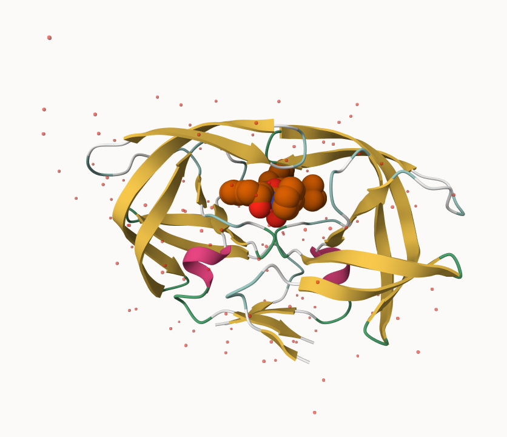
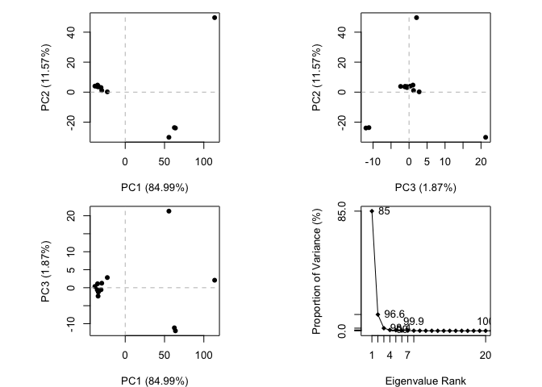
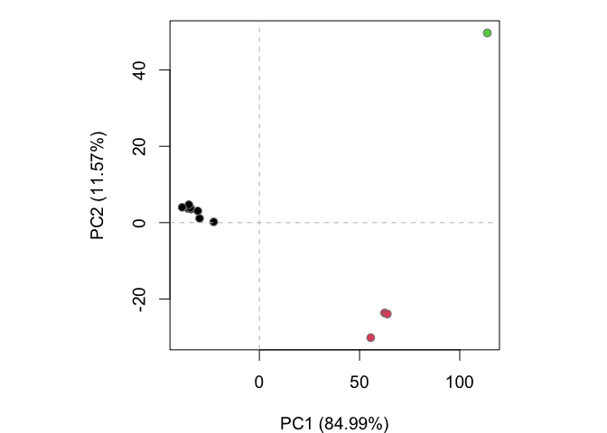

# Class 10 - Structural Bioinformatics
Melissa (PID: A19149673)

- [Background](#background)
- [PDB Statistics](#pdb-statistics)
  - [Visualizing the HIV-1 protease structure with
    Mol-Star](#visualizing-the-hiv-1-protease-structure-with-mol-star)
  - [Getting started with the bio3D
    package](#getting-started-with-the-bio3d-package)
  - [Predict the flexibility of a given
    structure](#predict-the-flexibility-of-a-given-structure)
  - [Comparative structure analysis of Adenylate
    Kinase](#comparative-structure-analysis-of-adenylate-kinase)

## Background

The main repository of high-resolution structural data on biomolecules
is called the \*\*Protein Data Bank\* (PDB).

# PDB Statistics

What is in the PDB in terms of molecule type and structure determination
method?

Read a CSV file of current PDB stats obtained from
https://www.rcsb.org/stats/summary

``` r
pdb <- read.csv ("Data Export Summary.csv")
pdb
```

               Molecular.Type   X.ray     EM    NMR Integrative Multiple.methods
    1          Protein (only) 180,758 23,111 12,813         348              229
    2 Protein/Oligosaccharide  10,488  3,741     34           8               11
    3              Protein/NA   9,205  6,751    287          26                8
    4     Nucleic acid (only)   3,154    250  1,578           3               15
    5                   Other     178     27     35           4                0
    6  Oligosaccharide (only)      11      0      6           0                1
      Neutron Other   Total
    1      84    32 217,375
    2       1     0  14,283
    3       0     0  16,277
    4       3     1   5,004
    5       0     0     244
    6       0     4      22

> Q1. What percentage of structures in the PDB are solved by X-Ray and
> Electron Microscopy.

``` r
pdb$X.ray
```

    [1] "180,758" "10,488"  "9,205"   "3,154"   "178"     "11"     

This print out above `pdb$X.ray` is “character” not “numeric”. Therefore
I can’t do math with it:

TWo functions that can help here are `sub()` and `as.numeric()`

``` r
# We want to get rid (or sub out) commas:

x <- pdb$X.ray
tmp <- sub(",","",x)
sum( as.numeric(tmp))
```

    [1] 203794

We could make a function to do this:

``` r
rm.comma <- function(x) {
  as.numeric(gsub(",", "", x))
}
```

``` r
n.tot <- rm.comma(pdb$Total)
n.xray <- rm.comma(pdb$`X-ray`)
n.em <- rm.comma(pdb$EM)

n.xray/n.tot * 100
```

    numeric(0)

``` r
n.em/n.tot * 100
```

    [1] 10.631857 26.191976 41.475702  4.996003 11.065574  0.000000

We could also use a different input function for this CSV that speaks
American (i.e. deals with commas in numbers in a comma separated value
file).

``` r
library(readr)
pdb <- read_csv("Data Export Summary.csv")
```

    Rows: 6 Columns: 9
    ── Column specification ────────────────────────────────────────────────────────
    Delimiter: ","
    chr (1): Molecular Type
    dbl (4): Integrative, Multiple methods, Neutron, Other
    num (4): X-ray, EM, NMR, Total

    ℹ Use `spec()` to retrieve the full column specification for this data.
    ℹ Specify the column types or set `show_col_types = FALSE` to quiet this message.

``` r
n.tot <- sum(pdb$Total)
n.xray <-sum(pdb$`X-ray`)
n.em <- sum(pdb$EM)

n.xray /n.tot *100
```

    [1] 80.48577

``` r
n.em / n.tot * 100
```

    [1] 13.38046

There is about 80% of structures in the PDB that are solved by X-Ray
while about 13% are solved using Electron Microscopy.

> Q2. What proportion of structures in the PDB are protein?

``` r
pdb$Total[1]
```

    [1] 217375

``` r
217375/202556314 * 100
```

    [1] 0.1073158

> **Key-point**: We have a very, very small structural coverage of known
> proteins (~0.1%). Most structures we know about (~80%) come from one
> method (X-ray) crystallography)

About 98% of structures in the PDB are protein or protein containing
complexes.

> Q3. Type HIV in the PDB website search box on the home page and
> determine how many HIV-1 protease structures are in the current PDB?

There are 4,998 HIV-1 protease structures that are in the current PDB.

## Visualizing the HIV-1 protease structure with Mol-Star

Main stand alone web version with all features is at
https://molstar.org/viewer/




> Q4. Water molecules normally have 3 atoms. Why do we see just one atom
> per water molecule in this structure?

We see just one atom per water molecule in this structure since the
X-ray crystallography usually detects the oxygen atom of water, while
the hydrogen atoms are too small and don’t scatter X-rays strongly
enough to be resolved clearly.

> Q5. There is a critical “conserved” water molecule in the binding
> site. Can you identify this water molecule? What residue number does
> this water molecule have

The conserved water molecule in the binding site is HOH.

> Q6. Generate and save a figure clearly showing the two distinct chains
> of HIV-protease along with the ligand. You might also consider showing
> the catalytic residues ASP 25 in each chain and the critical water (we
> recommend “Ball & Stick” for these side-chains). Add this figure to
> your Quarto document. - Discussion Topic: Can you think of a way in
> which indinavir, or even larger ligands and substrates, could enter
> the binding site?

.png)

## Getting started with the bio3D package

``` r
library(bio3d)
```

``` r
pdb <- read.pdb("1hsg")
```

      Note: Accessing on-line PDB file

``` r
pdb
```


     Call:  read.pdb(file = "1hsg")

       Total Models#: 1
         Total Atoms#: 1686,  XYZs#: 5058  Chains#: 2  (values: A B)

         Protein Atoms#: 1514  (residues/Calpha atoms#: 198)
         Nucleic acid Atoms#: 0  (residues/phosphate atoms#: 0)

         Non-protein/nucleic Atoms#: 172  (residues: 128)
         Non-protein/nucleic resid values: [ HOH (127), MK1 (1) ]

       Protein sequence:
          PQITLWQRPLVTIKIGGQLKEALLDTGADDTVLEEMSLPGRWKPKMIGGIGGFIKVRQYD
          QILIEICGHKAIGTVLVGPTPVNIIGRNLLTQIGCTLNFPQITLWQRPLVTIKIGGQLKE
          ALLDTGADDTVLEEMSLPGRWKPKMIGGIGGFIKVRQYDQILIEICGHKAIGTVLVGPTP
          VNIIGRNLLTQIGCTLNF

    + attr: atom, xyz, seqres, helix, sheet,
            calpha, remark, call

> Q7. How many amino acid residues are there in this pdb object?

There are 198 amino acid residues in this PDB structure

> Q8. Name one of the two non-protein residues?

One of the two non-protein residues is HOH (water) or MK1 which is the
ligand.

> Q9. How many protein chains are in this structure?

There are two protein chains, A and B, which are in this structure.

``` r
attributes(pdb)
```

    $names
    [1] "atom"   "xyz"    "seqres" "helix"  "sheet"  "calpha" "remark" "call"  

    $class
    [1] "pdb" "sse"

``` r
head(pdb$atom)
```

      type eleno elety  alt resid chain resno insert      x      y     z o     b
    1 ATOM     1     N <NA>   PRO     A     1   <NA> 29.361 39.686 5.862 1 38.10
    2 ATOM     2    CA <NA>   PRO     A     1   <NA> 30.307 38.663 5.319 1 40.62
    3 ATOM     3     C <NA>   PRO     A     1   <NA> 29.760 38.071 4.022 1 42.64
    4 ATOM     4     O <NA>   PRO     A     1   <NA> 28.600 38.302 3.676 1 43.40
    5 ATOM     5    CB <NA>   PRO     A     1   <NA> 30.508 37.541 6.342 1 37.87
    6 ATOM     6    CG <NA>   PRO     A     1   <NA> 29.296 37.591 7.162 1 38.40
      segid elesy charge
    1  <NA>     N   <NA>
    2  <NA>     C   <NA>
    3  <NA>     C   <NA>
    4  <NA>     O   <NA>
    5  <NA>     C   <NA>
    6  <NA>     C   <NA>

There are lots of functions that can work with these `pdb` objects:

``` r
head(pdbseq(pdb))
```

      1   2   3   4   5   6 
    "P" "Q" "I" "T" "L" "W" 

We can have a quick interactive view

``` r
library(bio3dview)
view.pdb(pdb)
```

Let’s try a custom view

``` r
view.pdb(pdb,
         colorScheme = "see",
         backgroundColor = "black")
```

> Q. Create a custom view of HIV-Pr highlighting the active site ASP
> residues (`resno=25`), the two chains (in your choice of colors) and
> the ligand all on a custom color background?

``` r
active.site <- atom.select(pdb, resno=25)

view.pdb(pdb, cols = c("red", "blue"),
         highlight = active.site,
         highlight.style = "spacefill",
         backgroundColor = "pink")
```

## Predict the flexibility of a given structure

Let’s do a Normal Mode Analysis (NMA) to predict the flexibility of a
give `pdb` object:

``` r
adk <- read.pdb("6s36")
```

      Note: Accessing on-line PDB file
       PDB has ALT records, taking A only, rm.alt=TRUE

``` r
adk
```


     Call:  read.pdb(file = "6s36")

       Total Models#: 1
         Total Atoms#: 1898,  XYZs#: 5694  Chains#: 1  (values: A)

         Protein Atoms#: 1654  (residues/Calpha atoms#: 214)
         Nucleic acid Atoms#: 0  (residues/phosphate atoms#: 0)

         Non-protein/nucleic Atoms#: 244  (residues: 244)
         Non-protein/nucleic resid values: [ CL (3), HOH (238), MG (2), NA (1) ]

       Protein sequence:
          MRIILLGAPGAGKGTQAQFIMEKYGIPQISTGDMLRAAVKSGSELGKQAKDIMDAGKLVT
          DELVIALVKERIAQEDCRNGFLLDGFPRTIPQADAMKEAGINVDYVLEFDVPDELIVDKI
          VGRRVHAPSGRVYHVKFNPPKVEGKDDVTGEELTTRKDDQEETVRKRLVEYHQMTAPLIG
          YYSKEAEAGNTKYAKVDGTKPVAEVRADLEKILG

    + attr: atom, xyz, seqres, helix, sheet,
            calpha, remark, call

``` r
# a quick structure summary
```

``` r
# Perform flexiblity prediction
m <- nma(adk)
```

     Building Hessian...        Done in 0.012 seconds.
     Diagonalizing Hessian...   Done in 0.267 seconds.

``` r
plot(m)
```


Write out the results for viewing in Mol-star:

``` r
mktrj(m, file="adk_m7.pdb")
```

``` r
view.nma(m, pdb=adk)
```

## Comparative structure analysis of Adenylate Kinase

> Q10. Which of the packages above is found only on BioConductor and not
> CRAN?

The msa package is only found on BioConductor and not CRAN.

> Q11. Which of the above packages is not found on BioConductor or
> CRAN?:

The bio3dview package is not found on CRAN or BioConductor and is
installed from GitHub.

> Q12. True or False? Functions from the pak package can be used to
> install packages from GitHub and BitBucket?

True

> Our first step is find a sequence for this family. We will use the
> database ID “1ake_A” here:

``` r
id <- "1ake_A"

aa <- get.seq(id)
```

    Warning in get.seq(id): Removing existing file: seqs.fasta

    Fetching... Please wait. Done.

``` r
aa
```

                 1        .         .         .         .         .         60 
    pdb|1AKE|A   MRIILLGAPGAGKGTQAQFIMEKYGIPQISTGDMLRAAVKSGSELGKQAKDIMDAGKLVT
                 1        .         .         .         .         .         60 

                61        .         .         .         .         .         120 
    pdb|1AKE|A   DELVIALVKERIAQEDCRNGFLLDGFPRTIPQADAMKEAGINVDYVLEFDVPDELIVDRI
                61        .         .         .         .         .         120 

               121        .         .         .         .         .         180 
    pdb|1AKE|A   VGRRVHAPSGRVYHVKFNPPKVEGKDDVTGEELTTRKDDQEETVRKRLVEYHQMTAPLIG
               121        .         .         .         .         .         180 

               181        .         .         .   214 
    pdb|1AKE|A   YYSKEAEAGNTKYAKVDGTKPVAEVRADLEKILG
               181        .         .         .   214 

    Call:
      read.fasta(file = outfile)

    Class:
      fasta

    Alignment dimensions:
      1 sequence rows; 214 position columns (214 non-gap, 0 gap) 

    + attr: id, ali, call

> Q13. How many amino acids are in this sequence, i.e. how long is this
> sequence?

The sequence contains 214 amino acids.

Search for related sequences in the database

``` r
blast <- blast.pdb(aa)
```

``` r
hits <- plot(blast)
```

``` r
hits <- NULL
hits$pdb.id <- c('1AKE_A','6S36_A','6RZE_A','3HPR_A','1E4V_A','5EJE_A','1E4Y_A','3X2S_A','6HAP_A','6HAM_A','4K46_A','3GMT_A','4PZL_A')
```

``` r
# Download related PDB files
files <- get.pdb(hits$pdb.id, path="pdbs", split=TRUE, gzip=TRUE)
```

    Warning in get.pdb(hits$pdb.id, path = "pdbs", split = TRUE, gzip = TRUE):
    pdbs/1AKE.pdb.gz exists. Skipping download

    Warning in get.pdb(hits$pdb.id, path = "pdbs", split = TRUE, gzip = TRUE):
    pdbs/6S36.pdb.gz exists. Skipping download

    Warning in get.pdb(hits$pdb.id, path = "pdbs", split = TRUE, gzip = TRUE):
    pdbs/6RZE.pdb.gz exists. Skipping download

    Warning in get.pdb(hits$pdb.id, path = "pdbs", split = TRUE, gzip = TRUE):
    pdbs/3HPR.pdb.gz exists. Skipping download

    Warning in get.pdb(hits$pdb.id, path = "pdbs", split = TRUE, gzip = TRUE):
    pdbs/1E4V.pdb.gz exists. Skipping download

    Warning in get.pdb(hits$pdb.id, path = "pdbs", split = TRUE, gzip = TRUE):
    pdbs/5EJE.pdb.gz exists. Skipping download

    Warning in get.pdb(hits$pdb.id, path = "pdbs", split = TRUE, gzip = TRUE):
    pdbs/1E4Y.pdb.gz exists. Skipping download

    Warning in get.pdb(hits$pdb.id, path = "pdbs", split = TRUE, gzip = TRUE):
    pdbs/3X2S.pdb.gz exists. Skipping download

    Warning in get.pdb(hits$pdb.id, path = "pdbs", split = TRUE, gzip = TRUE):
    pdbs/6HAP.pdb.gz exists. Skipping download

    Warning in get.pdb(hits$pdb.id, path = "pdbs", split = TRUE, gzip = TRUE):
    pdbs/6HAM.pdb.gz exists. Skipping download

    Warning in get.pdb(hits$pdb.id, path = "pdbs", split = TRUE, gzip = TRUE):
    pdbs/4K46.pdb.gz exists. Skipping download

    Warning in get.pdb(hits$pdb.id, path = "pdbs", split = TRUE, gzip = TRUE):
    pdbs/3GMT.pdb.gz exists. Skipping download

    Warning in get.pdb(hits$pdb.id, path = "pdbs", split = TRUE, gzip = TRUE):
    pdbs/4PZL.pdb.gz exists. Skipping download


      |                                                                            
      |                                                                      |   0%
      |                                                                            
      |=====                                                                 |   8%
      |                                                                            
      |===========                                                           |  15%
      |                                                                            
      |================                                                      |  23%
      |                                                                            
      |======================                                                |  31%
      |                                                                            
      |===========================                                           |  38%
      |                                                                            
      |================================                                      |  46%
      |                                                                            
      |======================================                                |  54%
      |                                                                            
      |===========================================                           |  62%
      |                                                                            
      |================================================                      |  69%
      |                                                                            
      |======================================================                |  77%
      |                                                                            
      |===========================================================           |  85%
      |                                                                            
      |=================================================================     |  92%
      |                                                                            
      |======================================================================| 100%

``` r
# Align related PDBs
pdbs <- pdbaln(files, fit = TRUE, exefile="msa")
```

    Reading PDB files:
    pdbs/split_chain/1AKE_A.pdb
    pdbs/split_chain/6S36_A.pdb
    pdbs/split_chain/6RZE_A.pdb
    pdbs/split_chain/3HPR_A.pdb
    pdbs/split_chain/1E4V_A.pdb
    pdbs/split_chain/5EJE_A.pdb
    pdbs/split_chain/1E4Y_A.pdb
    pdbs/split_chain/3X2S_A.pdb
    pdbs/split_chain/6HAP_A.pdb
    pdbs/split_chain/6HAM_A.pdb
    pdbs/split_chain/4K46_A.pdb
    pdbs/split_chain/3GMT_A.pdb
    pdbs/split_chain/4PZL_A.pdb
       PDB has ALT records, taking A only, rm.alt=TRUE
    .   PDB has ALT records, taking A only, rm.alt=TRUE
    .   PDB has ALT records, taking A only, rm.alt=TRUE
    .   PDB has ALT records, taking A only, rm.alt=TRUE
    ..   PDB has ALT records, taking A only, rm.alt=TRUE
    ....   PDB has ALT records, taking A only, rm.alt=TRUE
    .   PDB has ALT records, taking A only, rm.alt=TRUE
    ...

    Extracting sequences

    pdb/seq: 1   name: pdbs/split_chain/1AKE_A.pdb 
       PDB has ALT records, taking A only, rm.alt=TRUE
    pdb/seq: 2   name: pdbs/split_chain/6S36_A.pdb 
       PDB has ALT records, taking A only, rm.alt=TRUE
    pdb/seq: 3   name: pdbs/split_chain/6RZE_A.pdb 
       PDB has ALT records, taking A only, rm.alt=TRUE
    pdb/seq: 4   name: pdbs/split_chain/3HPR_A.pdb 
       PDB has ALT records, taking A only, rm.alt=TRUE
    pdb/seq: 5   name: pdbs/split_chain/1E4V_A.pdb 
    pdb/seq: 6   name: pdbs/split_chain/5EJE_A.pdb 
       PDB has ALT records, taking A only, rm.alt=TRUE
    pdb/seq: 7   name: pdbs/split_chain/1E4Y_A.pdb 
    pdb/seq: 8   name: pdbs/split_chain/3X2S_A.pdb 
    pdb/seq: 9   name: pdbs/split_chain/6HAP_A.pdb 
    pdb/seq: 10   name: pdbs/split_chain/6HAM_A.pdb 
       PDB has ALT records, taking A only, rm.alt=TRUE
    pdb/seq: 11   name: pdbs/split_chain/4K46_A.pdb 
       PDB has ALT records, taking A only, rm.alt=TRUE
    pdb/seq: 12   name: pdbs/split_chain/3GMT_A.pdb 
    pdb/seq: 13   name: pdbs/split_chain/4PZL_A.pdb 

``` r
library(bio3dview)
view.pdbs(pdbs)
```

Annotate collected PDB structures

``` r
# Vector containing PDB database codes
ids <- basename.pdb(pdbs$id)

anno <- pdb.annotate(ids)
unique(anno$source)
```

    [1] "Escherichia coli"                                
    [2] "Escherichia coli K-12"                           
    [3] "Escherichia coli O139:H28 str. E24377A"          
    [4] "Escherichia coli str. K-12 substr. MDS42"        
    [5] "Photobacterium profundum"                        
    [6] "Burkholderia pseudomallei 1710b"                 
    [7] "Francisella tularensis subsp. tularensis SCHU S4"

``` r
anno
```

           structureId chainId macromoleculeType chainLength experimentalTechnique
    1AKE_A        1AKE       A           Protein         214                 X-ray
    6S36_A        6S36       A           Protein         214                 X-ray
    6RZE_A        6RZE       A           Protein         214                 X-ray
    3HPR_A        3HPR       A           Protein         214                 X-ray
    1E4V_A        1E4V       A           Protein         214                 X-ray
    5EJE_A        5EJE       A           Protein         214                 X-ray
    1E4Y_A        1E4Y       A           Protein         214                 X-ray
    3X2S_A        3X2S       A           Protein         214                 X-ray
    6HAP_A        6HAP       A           Protein         214                 X-ray
    6HAM_A        6HAM       A           Protein         214                 X-ray
    4K46_A        4K46       A           Protein         214                 X-ray
    3GMT_A        3GMT       A           Protein         230                 X-ray
    4PZL_A        4PZL       A           Protein         242                 X-ray
           resolution       scopDomain                                        pfam
    1AKE_A       2.00 Adenylate kinase                      Adenylate kinase (ADK)
    6S36_A       1.60             <NA>                      Adenylate kinase (ADK)
    6RZE_A       1.69             <NA> Adenylate kinase, active site lid (ADK_lid)
    3HPR_A       2.00             <NA>                      Adenylate kinase (ADK)
    1E4V_A       1.85 Adenylate kinase                      Adenylate kinase (ADK)
    5EJE_A       1.90             <NA>                      Adenylate kinase (ADK)
    1E4Y_A       1.85 Adenylate kinase                      Adenylate kinase (ADK)
    3X2S_A       2.80             <NA>                                        <NA>
    6HAP_A       2.70             <NA>                      Adenylate kinase (ADK)
    6HAM_A       2.55             <NA>                      Adenylate kinase (ADK)
    4K46_A       2.01             <NA>                      Adenylate kinase (ADK)
    3GMT_A       2.10             <NA>                                        <NA>
    4PZL_A       2.10             <NA>                      Adenylate kinase (ADK)
                   ligandId
    1AKE_A              AP5
    6S36_A MG (2),NA,CL (3)
    6RZE_A    CL (2),NA (3)
    3HPR_A              AP5
    1E4V_A              AP5
    5EJE_A           AP5,CO
    1E4Y_A              AP5
    3X2S_A   JPY (2),AP5,MG
    6HAP_A              AP5
    6HAM_A              AP5
    4K46_A      PO4,AMP,ADP
    3GMT_A          SO4 (2)
    4PZL_A       GOL,FMT,CA
                                                                                 ligandName
    1AKE_A                                                 BIS(ADENOSINE)-5'-PENTAPHOSPHATE
    6S36_A                                    MAGNESIUM ION (2),SODIUM ION,CHLORIDE ION (3)
    6RZE_A                                                  CHLORIDE ION (2),SODIUM ION (3)
    3HPR_A                                                 BIS(ADENOSINE)-5'-PENTAPHOSPHATE
    1E4V_A                                                 BIS(ADENOSINE)-5'-PENTAPHOSPHATE
    5EJE_A                                 BIS(ADENOSINE)-5'-PENTAPHOSPHATE,COBALT (II) ION
    1E4Y_A                                                 BIS(ADENOSINE)-5'-PENTAPHOSPHATE
    3X2S_A N-(pyren-1-ylmethyl)acetamide (2),BIS(ADENOSINE)-5'-PENTAPHOSPHATE,MAGNESIUM ION
    6HAP_A                                                 BIS(ADENOSINE)-5'-PENTAPHOSPHATE
    6HAM_A                                                 BIS(ADENOSINE)-5'-PENTAPHOSPHATE
    4K46_A                   PHOSPHATE ION,ADENOSINE MONOPHOSPHATE,ADENOSINE-5'-DIPHOSPHATE
    3GMT_A                                                                  SULFATE ION (2)
    4PZL_A                                                 GLYCEROL,FORMIC ACID,CALCIUM ION
                                                     source
    1AKE_A                                 Escherichia coli
    6S36_A                                 Escherichia coli
    6RZE_A                                 Escherichia coli
    3HPR_A                            Escherichia coli K-12
    1E4V_A                                 Escherichia coli
    5EJE_A           Escherichia coli O139:H28 str. E24377A
    1E4Y_A                                 Escherichia coli
    3X2S_A         Escherichia coli str. K-12 substr. MDS42
    6HAP_A           Escherichia coli O139:H28 str. E24377A
    6HAM_A                            Escherichia coli K-12
    4K46_A                         Photobacterium profundum
    3GMT_A                  Burkholderia pseudomallei 1710b
    4PZL_A Francisella tularensis subsp. tularensis SCHU S4
                                                                                                                                                                         structureTitle
    1AKE_A STRUCTURE OF THE COMPLEX BETWEEN ADENYLATE KINASE FROM ESCHERICHIA COLI AND THE INHIBITOR AP5A REFINED AT 1.9 ANGSTROMS RESOLUTION: A MODEL FOR A CATALYTIC TRANSITION STATE
    6S36_A                                                                                                                   Crystal structure of E. coli Adenylate kinase R119K mutant
    6RZE_A                                                                                                                   Crystal structure of E. coli Adenylate kinase R119A mutant
    3HPR_A                                                                                               Crystal structure of V148G adenylate kinase from E. coli, in complex with Ap5A
    1E4V_A                                                                                                       Mutant G10V of adenylate kinase from E. coli, modified in the Gly-loop
    5EJE_A                                                                                  Crystal structure of E. coli Adenylate kinase G56C/T163C double mutant in complex with Ap5a
    1E4Y_A                                                                                                        Mutant P9L of adenylate kinase from E. coli, modified in the Gly-loop
    3X2S_A                                                                                                                      Crystal structure of pyrene-conjugated adenylate kinase
    6HAP_A                                                                                                                                                             Adenylate kinase
    6HAM_A                                                                                                                                                             Adenylate kinase
    4K46_A                                                                                                          Crystal Structure of Adenylate Kinase from Photobacterium profundum
    3GMT_A                                                                                                         Crystal structure of adenylate kinase from burkholderia pseudomallei
    4PZL_A                                                                              The crystal structure of adenylate kinase from Francisella tularensis subsp. tularensis SCHU S4
                                                         citation rObserved   rFree
    1AKE_A              Muller, C.W., et al. J Mol Biology (1992)   0.19600      NA
    6S36_A                  Rogne, P., et al. Biochemistry (2019)   0.16320 0.23560
    6RZE_A                  Rogne, P., et al. Biochemistry (2019)   0.18650 0.23500
    3HPR_A  Schrank, T.P., et al. Proc Natl Acad Sci U S A (2009)   0.21000 0.24320
    1E4V_A                   Muller, C.W., et al. Proteins (1993)   0.19600      NA
    5EJE_A  Kovermann, M., et al. Proc Natl Acad Sci U S A (2017)   0.18890 0.23580
    1E4Y_A                   Muller, C.W., et al. Proteins (1993)   0.17800      NA
    3X2S_A                Fujii, A., et al. Bioconjug Chem (2015)   0.20700 0.25600
    6HAP_A               Kantaev, R., et al. J Phys Chem B (2018)   0.22630 0.27760
    6HAM_A               Kantaev, R., et al. J Phys Chem B (2018)   0.20511 0.24325
    4K46_A                    Cho, Y.-J., et al. To be published    0.17000 0.22290
    3GMT_A Buchko, G.W., et al. Biochem Biophys Res Commun (2010)   0.23800 0.29500
    4PZL_A                       Tan, K., et al. To be published    0.19360 0.23680
             rWork spaceGroup
    1AKE_A 0.19600  P 21 2 21
    6S36_A 0.15940    C 1 2 1
    6RZE_A 0.18190    C 1 2 1
    3HPR_A 0.20620  P 21 21 2
    1E4V_A 0.19600  P 21 2 21
    5EJE_A 0.18630  P 21 2 21
    1E4Y_A 0.17800   P 1 21 1
    3X2S_A 0.20700 P 21 21 21
    6HAP_A 0.22370    I 2 2 2
    6HAM_A 0.20311       P 43
    4K46_A 0.16730 P 21 21 21
    3GMT_A 0.23500   P 1 21 1
    4PZL_A 0.19130       P 32

``` r
# Perform PCA
pc.xray <- pca(pdbs)
plot(pc.xray)
```



``` r
# Calculate RMSD
rd <- rmsd(pdbs)
```

    Warning in rmsd(pdbs): No indices provided, using the 204 non NA positions

``` r
# Structure-based clustering
hc.rd <- hclust(dist(rd))
grps.rd <- cutree(hc.rd, k=3)

plot(pc.xray, 1:2, col="grey50", bg=grps.rd, pch=21, cex=1)
```



``` r
# Visualize first principal component
pc1 <- mktrj(pc.xray, pc=1, file="pc_1.pdb")
```

PCA of all this structural data (x, y and z atom coordinates).

``` r
pc <- pca (pdbs)
plot(pc, 1:2)
```


