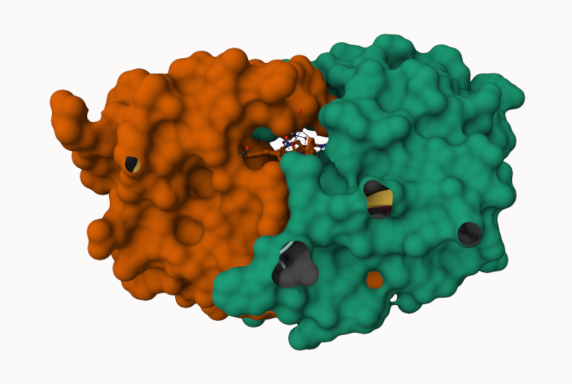

## Background

The main repository of high-resolution structural data on biomolecules is called the **Protein Data Bank* (PDB).

# PDB Statistics

What is in the PDB in terms of molecule type and structure determination method?

Read a CSV file of current PDB stats obtained from https://www.rcsb.org/stats/summary

```{r}
pdb <- read.csv ("Data Export Summary.csv")
pdb
```

> Q1. What percentage of structures in the PDB are solved by X-Ray and Electron Microscopy.

```{r}
pdb$X.ray
```
This print out above `pdb$X.ray` is "character" not "numeric". Therefore I can't do math with it:

TWo functions that can help here are `sub()` and `as.numeric()`

```{r}
# We want to get rid (or sub out) commas:

x <- pdb$X.ray
tmp <- sub(",","",x)
sum( as.numeric(tmp))
```
We could make a function to do this:

```{r}
rm.comma <- function(x) {
  as.numeric(gsub(",", "", x))
}
```

```{r}
n.tot <- rm.comma(pdb$Total)
n.xray <- rm.comma(pdb$`X-ray`)
n.em <- rm.comma(pdb$EM)

n.xray/n.tot * 100
n.em/n.tot * 100
```
We could also use a different input function for this CSV that speaks American (i.e. deals with commas in numbers in a comma separated value file).

```{r}
library(readr)
pdb <- read_csv("Data Export Summary.csv")
```


```{r}
n.tot <- sum(pdb$Total)
n.xray <-sum(pdb$`X-ray`)
n.em <- sum(pdb$EM)

n.xray /n.tot *100
n.em / n.tot * 100
```

There is about 80% of structures in the PDB that are solved by X-Ray while about 13% are solved using Electron Microscopy.

> Q2. What proportion of structures in the PDB are protein?

```{r}
pdb$Total[1]
```

```{r}
217375/202556314 * 100
```

> **Key-point**: We have a very, very small structural coverage of known proteins (~0.1%). Most structures we know about (~80%) come from one method (X-ray) crystallography)

About 98% of structures in the PDB are protein or protein containing complexes.

> Q3. Type HIV in the PDB website search box on the home page and determine how many HIV-1 protease structures are in the current PDB?

There are 4,998 HIV-1 protease structures that are in the current PDB.

## Visualizing the HIV-1 protease structure with Mol-Star

Main stand alone web version with all features is at
https://molstar.org/viewer/




> Q4. Water molecules normally have 3 atoms. Why do we see just one atom per water molecule in this structure?

We see just one atom per water molecule in this structure since the X-ray crystallography usually detects the oxygen atom of water, while the hydrogen atoms are too small and don't scatter X-rays strongly enough to be resolved clearly.

> Q5. There is a critical “conserved” water molecule in the binding site. Can you identify this water molecule? What residue number does this water molecule have

The conserved water molecule in the binding site is HOH. 

> Q6. Generate and save a figure clearly showing the two distinct chains of HIV-protease along with the ligand. You might also consider showing the catalytic residues ASP 25 in each chain and the critical water (we recommend “Ball & Stick” for these side-chains). Add this figure to your Quarto document. - Discussion Topic: Can you think of a way in which indinavir, or even larger ligands and substrates, could enter the binding site?


.png)

## Getting started with the bio3D package

```{r}
library(bio3d)
```


```{r}
pdb <- read.pdb("1hsg")
pdb
```

> Q7. How many amino acid residues are there in this pdb object? 

There are 198 amino acid residues in this PDB structure

> Q8. Name one of the two non-protein residues? 

One of the two non-protein residues is HOH (water) or MK1 which is the ligand.

> Q9. How many protein chains are in this structure? 

There are two protein chains, A and B, which are in this structure.


```{r}
attributes(pdb)
```

```{r}
head(pdb$atom)
```

There are lots of functions that can work with these `pdb` objects:
```{r}
head(pdbseq(pdb))
```

We can have a quick interactive view 

```{r, eval=FALSE}
library(bio3dview)
view.pdb(pdb)
```
Let's try a custom view

```{r, eval=FALSE}
view.pdb(pdb,
         colorScheme = "see",
         backgroundColor = "black")
```

> Q. Create a custom view of HIV-Pr highlighting the active site ASP residues (`resno=25`), the two chains (in your choice of colors) and the ligand all on a custom color background?

```{r, eval=FALSE}
active.site <- atom.select(pdb, resno=25)

view.pdb(pdb, cols = c("red", "blue"),
         highlight = active.site,
         highlight.style = "spacefill",
         backgroundColor = "pink")
```

## Predict the flexibility of a given structure 

Let's do a Normal Mode Analysis (NMA) to predict the flexibility of a give `pdb` object:

```{r}
adk <- read.pdb("6s36")
adk
# a quick structure summary
```

```{r}
# Perform flexiblity prediction
m <- nma(adk)
plot(m)
```

Write out the results for viewing in Mol-star:

```{r}
mktrj(m, file="adk_m7.pdb")
```

```{r, eval=FALSE}
view.nma(m, pdb=adk)
```

## Comparative structure analysis of Adenylate Kinase

> Q10. Which of the packages above is found only on BioConductor and not CRAN? 

The msa package is only found on BioConductor and not CRAN.

> Q11. Which of the above packages is not found on BioConductor or CRAN?: 

The bio3dview package is not found on CRAN or BioConductor and is installed from GitHub.

> Q12. True or False? Functions from the pak package can be used to install packages from GitHub and BitBucket? 

True

> Our first step is find a sequence for this family. We will use the database ID "1ake_A" here:

```{r}
id <- "1ake_A"

aa <- get.seq(id)
aa
```
> Q13. How many amino acids are in this sequence, i.e. how long is this sequence? 

The sequence contains 214 amino acids.

Search for related sequences in the database

```{r, eval=FALSE}
blast <- blast.pdb(aa)
```

```{r, eval=FALSE}
hits <- plot(blast)
```

```{r}
hits <- NULL
hits$pdb.id <- c('1AKE_A','6S36_A','6RZE_A','3HPR_A','1E4V_A','5EJE_A','1E4Y_A','3X2S_A','6HAP_A','6HAM_A','4K46_A','3GMT_A','4PZL_A')
```

```{r}
# Download related PDB files
files <- get.pdb(hits$pdb.id, path="pdbs", split=TRUE, gzip=TRUE)
```


```{r}
# Align related PDBs
pdbs <- pdbaln(files, fit = TRUE, exefile="msa")
```


```{r, eval=FALSE}
library(bio3dview)
view.pdbs(pdbs)
```

Annotate collected PDB structures

```{r}
# Vector containing PDB database codes
ids <- basename.pdb(pdbs$id)

anno <- pdb.annotate(ids)
unique(anno$source)
anno
```


```{r}
# Perform PCA
pc.xray <- pca(pdbs)
plot(pc.xray)
```

```{r}
# Calculate RMSD
rd <- rmsd(pdbs)

# Structure-based clustering
hc.rd <- hclust(dist(rd))
grps.rd <- cutree(hc.rd, k=3)

plot(pc.xray, 1:2, col="grey50", bg=grps.rd, pch=21, cex=1)
```


```{r}
# Visualize first principal component
pc1 <- mktrj(pc.xray, pc=1, file="pc_1.pdb")
```

PCA of all this structural data (x, y and z atom coordinates).

```{r}
pc <- pca (pdbs)
plot(pc, 1:2)
```